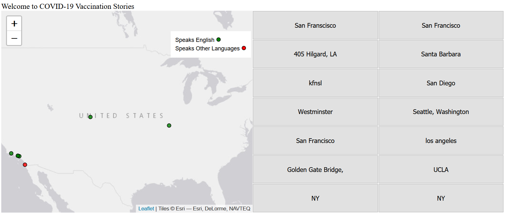
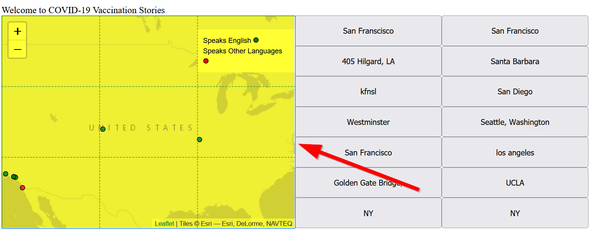

# Final Finishing Touches

### Objectives:
- Touch up our map with a legend
- Revisiting legendary CSS Grid
- Final Tech Tips
  - Check out JavaScript Libraries
    - turf.js
    - chart.js
  - Manipulate geospatial data with:
      - geojson.io
      - MapShaper
  - Add a new Leaflet plugins
- In-class Group(!) Assignment




## Setup

Start by creating a `week_10` folder in your assignments repo.

### Boiler Plate code
Create the following files:
> index.html
``` html
<!DOCTYPE html>
<html>
    <head>
        <title>COVID-19 Vaccination Stories</title>
        <meta charset="utf-8" />
        <link rel="shortcut icon" href="#">
        <link rel="stylesheet" href="styles/style.css">

        <!-- Leaflet's css-->
        <link rel="stylesheet" href="https://unpkg.com/leaflet@1.7.1/dist/leaflet.css" />

        <!-- Leaflet's JavaScript-->
        <script src="https://unpkg.com/leaflet@1.7.1/dist/leaflet.js"></script>
    </head>
    
     <body>
        <header>Welcome to COVID-19 Vaccination Stories</header>
        <div id="contents"></div>
        <div id="map"></div>
        <div id="survey">
            <iframe src="https://docs.google.com/forms/d/e/1FAIpQLSdqVT10bEbUrULMu6Etwj4ZBXGf-LAxcKohAINFbIdZmHS6OA/viewform?embedded=true" width="640" height="654" frameborder="0" marginheight="0" marginwidth="0">Loading…</iframe>
        </div>
        <script src="js/init.js"></script>
    </body>
</html>
```

> js/init.js
```js
const map = L.map('map').setView([34.0709, -118.444], 5);

const url = "https://spreadsheets.google.com/feeds/list/1upD99bKWIO68jL8MKWV67KE-_H_TVn2bCwqyQkqNsBw/oxw5dh3/public/values?alt=json"

let Esri_WorldGrayCanvas = L.tileLayer('https://server.arcgisonline.com/ArcGIS/rest/services/Canvas/World_Light_Gray_Base/MapServer/tile/{z}/{y}/{x}', {
	attribution: 'Tiles &copy; Esri &mdash; Esri, DeLorme, NAVTEQ',
	maxZoom: 16
});

Esri_WorldGrayCanvas.addTo(map)

// L.tileLayer('https://{s}.tile.openstreetmap.org/{z}/{x}/{y}.png', {
//     attribution: '&copy; <a href="https://www.openstreetmap.org/copyright">OpenStreetMap</a> contributors'
// }).addTo(map);

fetch(url)
	.then(response => {
		return response.json();
		})
    .then(data =>{
                // console.log(data)
                formatData(data)
        }
)

let speakFluentEnglish = L.featureGroup();
let speakOtherLanguage = L.featureGroup();

let exampleOptions = {
    radius: 4,
    fillColor: "#ff7800",
    color: "#000",
    weight: 1,
    opacity: 1,
    fillOpacity: 0.8
}

function addMarker(data){
    if(data.doyouspeakenglishfluently == "Yes"){
        exampleOptions.fillColor = "green"
        speakFluentEnglish.addLayer(L.circleMarker([data.lat,data.lng],exampleOptions).bindPopup(`<h2>Speak English fluently</h2>`))
        createButtons(data.lat,data.lng,data.location)
        }
    else{
        exampleOptions.fillColor = "red"
        speakOtherLanguage.addLayer(L.circleMarker([data.lat,data.lng],exampleOptions).bindPopup(`<h2>Speak other languages</h2>`))
        createButtons(data.lat,data.lng,data.location)
    }
    return data.timestamp
}

function createButtons(lat,lng,title){
    const newButton = document.createElement("button");
    newButton.id = "button"+title;
    newButton.innerHTML = title;
    newButton.setAttribute("lat",lat); 
    newButton.setAttribute("lng",lng);
    newButton.addEventListener('click', function(){
        map.flyTo([lat,lng]);
    })
    const spaceForButtons = document.getElementById('contents')
    spaceForButtons.appendChild(newButton);
}

function formatData(theData){
        const formattedData = []
        const rows = theData.feed.entry
        for(const row of rows) {
          const formattedRow = {}
          for(const key in row) {
            if(key.startsWith("gsx$")) {
                  formattedRow[key.replace("gsx$", "")] = row[key].$t
            }
          }
          formattedData.push(formattedRow)
        }
        console.log(formattedData)
        formattedData.forEach(addMarker)
        speakFluentEnglish.addTo(map)
        speakOtherLanguage.addTo(map)
        let allLayers = L.featureGroup([speakFluentEnglish,speakOtherLanguage]);
        map.fitBounds(allLayers.getBounds());        
}

let layers = {
	"Speaks English": speakFluentEnglish,
	"Speaks Other Languages": speakOtherLanguage
}

L.control.layers(null,layers).addTo(map)
```
>styles/style.css
```css
body{
    display: grid;
    grid-template-columns: 1fr 1fr; 
    grid-auto-rows: minmax(5px, auto);
    grid-template-areas: "header header" "mappanel sidebar" 
}

header{
    grid-area: header;
}

#map{
    height:90vh;
    grid-area: mappanel;
} 

#contents{
    grid-area: sidebar;
    display:grid;
    grid-template-columns: repeat(2, 1fr);
}

/* fix for survey to fit in the iframe */
#survey {
    overflow: hidden;
    /* 16:9 aspect ratio */
    padding-top: 0%;
    position: relative;
}

#survey iframe {
   border: 0;
   height: 100%;
   left: 0;
   position: absolute;
   top: 0;
   width: 100%;
}
```

## Legendary Additions!
Let's start by making our legend not collapsable:

Change the `L.control.layers(null,layers).addTo(map)` to:
```js
L.control.layers(null,layers,{collapsed:false}).addTo(map)
``` 
We can do better though and add an actual legend. Notice the `let layers ={}` object right above the `L.control` that we changed. The properties in there `Speaks English` and `Speaks Other Language` are actually HTML content that controls how the layers are displayed.

We will add a `<svg>` which is an `svg` element. 
Our `layers` object should look like the following:
```js
let layers = {
	"Speaks English <svg height='10' width='10'><circle cx='5' cy='5' r='4' stroke='black' stroke-width='1' fill='green' /></svg>": speakFluentEnglish,
	"Speaks Other Languages <svg height='10' width='10'><circle cx='5' cy='5' r='4' stroke='black' stroke-width='1' fill='red' /></svg>": speakOtherLanguage
}
```
A much more useful legend should appear. As mentioned before, I'm not a big fan of the Leaflet legend, as there are many more user friendly ways to display a legend, like having the a different `<div>` on the page.

### Why are legends important?
They help to provide context into what is represented on the map. This makes sure as we construct our narrative that people know what is represented on the map and do not have to guess what is being shown.

Since legends are so important, many people have implemented different versions of a legend on Leaflet, including your classmates!

## Implement different layouts with CSS Grid
Before we get into adding new plugins, CSS Grid is a powerful way to control how functionality relates to each other. The flexibility of grid helps to make sure that specific `rows` or `columns` are able to be targeted no matter what plugins we use.

### CSS Grid Legend
Let's revisit our `index.html` and create a new `div` element on the map layer called with an id of `legend`:
>index.html
```html
        <div id="map">
            <div id="legend">
            </div>
        </div>
```
In our style.css we will turn the map into a grid and add a 4 by 4 grid as follows:
```css
#map{
    height:90vh;
    grid-area: mappanel;
    display: grid;
    grid-template-columns: repeat(3, minmax(0, 1fr));
    grid-template-rows: repeat(3, minmax(0, 1fr));
} 
```



### Why the `minmax(0,1fr)` instead of just `1fr`?
If you do `1fr` then you run the risk of images and other content overflowing and not respecting the grid when it is empty. You can read more about it here:

- https://css-tricks.com/preventing-a-grid-blowout/

### Justifying and aligning our content
While in the `#map` lets make sure our content fits in the middle of our grid by using `align-items: center` and `justify-items: center`. Align is used for horizontal alignment and justify is used for vertical adjustments. You can read more about align and justify here:

- https://www.digitalocean.com/community/tutorials/css-align-justify

```css
#map{
    height:90vh;
    grid-area: mappanel;
    display: grid;
    grid-template-columns: repeat(3, minmax(0, 1fr));
    grid-template-rows: repeat(3, minmax(0, 1fr));
    align-items: center;
    justify-items: center;  
} 
```

Let's add the legend to the lower right corner of our map, by adding the following CSS selector for `#legend`:

```css
#legend{
    grid-column: 1;
    grid-row: 3;
}
```
Notice the following:
- `grid-column: 1;` says put this content into the first column!
- `grid-row: 3;` says put this content into the 3rd row.
Our style should look like this:

```css
#legend{
    grid-column: 1;
    grid-row: 3;
    align-items: center;
    justify-items: center;
}
```
To span multiple rows or columns ontop of specifying a number you can do `grid-column: 1 / span 2;` which will make the content span 2 columns from the left to right!

### Class Exercise #1: Getting CSS-Griddy with it!
Practice using CSS Grid to change the location of the legend to the top right corner where the current legend is. Try to make it span more than 1 column or row.

 **Bonus: See if you can remove the Leaflet Legend in the top right corner**

<details>
<summary><b>Answer</b></summary>

>styles/style.css
```css
#map{
    height:90vh;
    grid-area: mappanel;
    display: grid;
    grid-template-columns: repeat(3, minmax(0, 1fr));
    grid-template-rows: repeat(3, minmax(0, 1fr));
    align-items: center;
    justify-items: center;  
} 

#legend{
    grid-column: 2 / span 2;
    grid-row: 1;
}
```
Bonus answer:
>.js/init.js
```js
// L.control.layers(null,layers,{collapsed:false}).addTo(map)
```
Awesome! Now the time has come to add our legendary HTML:
>index.html
```html
<div id="legend">
    <div>Speaks English
        <svg height="10" width="10"><circle cx="5" cy="5" r="4" stroke="black" stroke-width="1" fill="green" /></svg> 
    </div>
    <div> Speaks Other Languages 
        <svg height="10" width="10"><circle cx="5" cy="5" r="4" stroke="black" stroke-width="1" fill="green" /></svg> 
    </div>
</div>
```
</details>

### What Z-heck?
Unfortunately, Leaflet has a higher `Z-index` than our legend so we need to use CSS to make our `Z-index` higher for the legend. If you think of a webpage as height being y-value, width being x-values, then the stacking of content is controlled by the Z-index. 

Basically, a Z-index is value that controls which layers are on-top of other layers in a webpage.

We will change this in our style.css and make some other nice tweaks in the process:

>styles/style.css
```css
#legend{
    grid-column: 3;
    grid-row: 1;
    z-index: 9999;
    background-color: white;
    padding:10px;
}
```

## Final Lab Code
Up to this point, you lab code should look like the following:

>index.html
```html
<!DOCTYPE html>
<html>
    <head>
        <title>COVID-19 Vaccination Stories</title>
        <meta charset="utf-8" />
        <link rel="shortcut icon" href="#">
        <link rel="stylesheet" href="styles/style.css">

        <!-- Leaflet's css-->
        <link rel="stylesheet" href="https://unpkg.com/leaflet@1.7.1/dist/leaflet.css" />

        <!-- Leaflet's JavaScript-->
        <script src="https://unpkg.com/leaflet@1.7.1/dist/leaflet.js"></script>
    </head>
    
     <body>
        <header>Welcome to COVID-19 Vaccination Stories</header>
        <div id="contents"></div>
        <div id="map"></div>
        <div id="survey">
            <iframe src="https://docs.google.com/forms/d/e/1FAIpQLSdqVT10bEbUrULMu6Etwj4ZBXGf-LAxcKohAINFbIdZmHS6OA/viewform?embedded=true" width="640" height="654" frameborder="0" marginheight="0" marginwidth="0">Loading…</iframe>
        </div>
        <script src="js/init.js"></script>
    </body>
</html>
```
>js/init.js
```js
const map = L.map('map').setView([34.0709, -118.444], 5);

const url = "https://spreadsheets.google.com/feeds/list/1upD99bKWIO68jL8MKWV67KE-_H_TVn2bCwqyQkqNsBw/oxw5dh3/public/values?alt=json"

let Esri_WorldGrayCanvas = L.tileLayer('https://server.arcgisonline.com/ArcGIS/rest/services/Canvas/World_Light_Gray_Base/MapServer/tile/{z}/{y}/{x}', {
	attribution: 'Tiles &copy; Esri &mdash; Esri, DeLorme, NAVTEQ',
	maxZoom: 16
});

Esri_WorldGrayCanvas.addTo(map)

fetch(url)
	.then(response => {
		return response.json();
		})
    .then(data =>{
                // console.log(data)
                formatData(data)
        }
)

let speakFluentEnglish = L.featureGroup();
let speakOtherLanguage = L.featureGroup();

let exampleOptions = {
    radius: 4,
    fillColor: "#ff7800",
    color: "#000",
    weight: 1,
    opacity: 1,
    fillOpacity: 0.8
}

function addMarker(data){
    if(data.doyouspeakenglishfluently == "Yes"){
        exampleOptions.fillColor = "green"
        speakFluentEnglish.addLayer(L.circleMarker([data.lat,data.lng],exampleOptions).bindPopup(`<h2>Speak English fluently</h2>`))
        createButtons(data.lat,data.lng,data.location)
        }
    else{
        exampleOptions.fillColor = "red"
        speakOtherLanguage.addLayer(L.circleMarker([data.lat,data.lng],exampleOptions).bindPopup(`<h2>Speak other languages</h2>`))
        createButtons(data.lat,data.lng,data.location)
    }
    return data.timestamp
}

function createButtons(lat,lng,title){
    const newButton = document.createElement("button");
    newButton.id = "button"+title;
    newButton.innerHTML = title;
    newButton.setAttribute("lat",lat); 
    newButton.setAttribute("lng",lng);
    newButton.addEventListener('click', function(){
        map.flyTo([lat,lng]);
    })
    const spaceForButtons = document.getElementById('contents')
    spaceForButtons.appendChild(newButton);
}

function formatData(theData){
        const formattedData = []
        const rows = theData.feed.entry
        for(const row of rows) {
          const formattedRow = {}
          for(const key in row) {
            if(key.startsWith("gsx$")) {
                  formattedRow[key.replace("gsx$", "")] = row[key].$t
            }
          }
          formattedData.push(formattedRow)
        }
        console.log(formattedData)
        formattedData.forEach(addMarker)
        speakFluentEnglish.addTo(map)
        speakOtherLanguage.addTo(map)
        let allLayers = L.featureGroup([speakFluentEnglish,speakOtherLanguage]);
        map.fitBounds(allLayers.getBounds());        
}

let layers = {
	"Speaks English": speakFluentEnglish,
	"Speaks Other Languages": speakOtherLanguage
}

L.control.layers(null,layers).addTo(map)
```

>styles/style.css
```css
body{
    display: grid;
    grid-template-columns: 1fr 1fr; 
    grid-auto-rows: minmax(5px, auto);
    grid-template-areas: "header header" "mappanel sidebar" 
}

header{
    grid-area: header;
}

#map{
    height:90vh;
    grid-area: mappanel;
    display: grid;
    grid-template-columns: repeat(3, minmax(0, 1fr));
    grid-template-rows: repeat(3, minmax(0, 1fr));
    align-items: center;
    justify-items: center;  
} 

#legend{
    grid-column: 3;
    grid-row: 1;
    z-index: 9999;
    background-color: white;
    padding:10px;
}

#contents{
    grid-area: sidebar;
    display:grid;
    grid-template-columns: repeat(2, 1fr);
}

/* fix for survey to fit in the iframe */
#survey {
    overflow: hidden;
    /* 16:9 aspect ratio */
    padding-top: 0%;
    position: relative;
}

#survey iframe {
   border: 0;
   height: 100%;
   left: 0;
   position: absolute;
   top: 0;
   width: 100%;
}
```
## Final Tech Tips!


Now that we have a better sense of how to use CSS grid, we can think about how to fit other libraries and tools.

Evaluating the right libraries and tools for the task is an important part of being a web developer that is both ethically minded and able to contribute back to meaningful projects. 

## Turf.js

https://turfjs.org/

Turfjs is useful for running spatial analysis in our mapplications.

Here is my example repo using Turf.js to count the number of points inside a particular boundary:

https://github.com/albertkun/leaflet-tufjs-spatial-join


## Chart.js


https://www.chartjs.org/

[Chartjs](https://www.chartjs.org/) is useful (but complex) library for creating charts in our mapplications.

Below is an example repository demonstrating how to use Chartjs with your Leaflet data:
https://github.com/albertkun/leaflet-chartjs


## GeoJSON.io


http://geojson.io/

Remember this tool? GeoJSON.io is useful for creating, converting, or quickly editing spatial data online.


## MapShaper


https://mapshaper.org/

This online tool helps to reduce file sizes of GeoJSONs and do other geoprocessing of GIS data:

> Main Tip: Choose the right tool for the job!

### Extending Leaflet with Plugins
Owing to the opensource nature of Leaflet, people have written many reusable tools to help with common tasks. As a matter of fact, if you have written a function for Leaflet that you think is reusable, you can go ahead and submit to their list of plugins too! Ah, the awesomeness of open source!

## Balance Open Source with an open and ethical mind
Of course, open source has its drawbacks too, learning to customize someone elses poorly written code with poor documentation can be a huge timesink.

Balancing the trade-off between trying to reuse someone's code and creating your own is an important step in becoming a seasoned developer!

Working within and with other projects bring us to our final lab topic of utilizing other people's Leaflet widgets and plugins.

### Final Class Exercise: 
#### Due 6/1 in class

Join breakout rooms with your group. With the remaining time, look at some of the plugins below and try to implement them into your mapplication or your own group projects: 
  - UI
    - https://github.com/noerw/leaflet-sidebar-v2
    - https://github.com/turbo87/sidebar-v2/
    - https://github.com/mapshakers/leaflet-control-window
    - https://cliffcloud.github.io/Leaflet.Sleep/
  - Markers:
    - https://github.com/masajid390/BeautifyMarker
    - https://github.com/mapshakers/leaflet-icon-pulse
    - https://dagjomar.github.io/Leaflet.ParallaxMarker/
    - https://wbkd.github.io/leaflet-swoopy/
  - Others
    - https://github.com/albertkun/leaflet_hex_timeslider

Leave a review of them in the Git-Practicing Repo:
- https://github.com/albertkun/21S-AA191-GitPracticing/blob/main/review.md

Feel free to try others not in this list and add it to the doc.

Pay attention to how important good documentation is and how your own group projects `readme.md` should be structured. Creating a `branch` will be helpful when testing new features. Refer to [lab 8](../Week_8/Lab/readme.md) for a refresher.

### Submission
As a group, make a pull request in the following repo with your comments on a plugin:
- https://github.com/albertkun/21S-AA191-GitPracticing/blob/main/review.md
